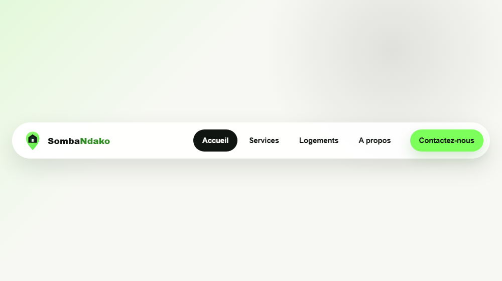

# Navigation responsive avec Flexbox

Composant de navbar responsive adapte depuis le projet
[housing-landing-page](https://github.com/Osiris-Balonga/housing-landing-page).
Le but est de repondre au livrable Akieni Academy Semaine 4: construire une
barre de navigation responsive qui devient un menu burger sur mobile.



## Objectif

- Reutiliser l'identite Somba Ndako du projet source pour la navbar.
- Presenter le composant seul, dans une demo type CodePen.
- Ajouter un menu burger fonctionnel au clic sans JavaScript.
- Respecter un breakpoint mobile a 768px.
- Garder une structure HTML semantique et accessible.

## Specifications couvertes

- Logo a gauche.
- Menu principal aligne avec Flexbox.
- Bouton "Contactez-nous" stylise.
- Burger visible sur mobile.
- Animation smooth du burger et du panneau mobile.
- Breakpoint responsive a 768px.
- Pas de float.
- Attribut `aria-label` sur le controle burger.
- Toggle mobile realise en HTML/CSS avec checkbox cachee.

## Structure

```text
navbar-responsive/
  assets/
    images/
      readme-preview.png
      somba-ndako-logo.svg
  index.html
  style.css
  README.md
```

## Lancer le projet

Ouvrir `index.html` dans un navigateur.

## Source

- Repository source: https://github.com/Osiris-Balonga/housing-landing-page
- Assets repris: logo Somba Ndako et image d'apercu README.

## Notes de revue

La navbar source utilisait une mise en page plus avancee avec CSS Grid et un
menu mobile base sur `<details>`. Cette version garde seulement le composant
demande: Flexbox visible, breakpoint 768px et bouton burger controle sans
JavaScript.
